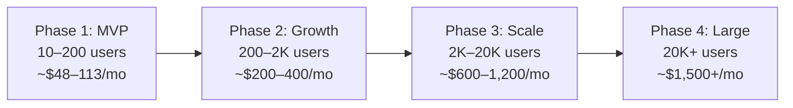

# CricIt — MVP Cost Estimate & Scaling Roadmap

## 1. MVP Estimated Monthly Cost (10–200 Users)

### AWS Prod Environment

| Service | Spec | Monthly Cost | Notes |
|---|---|---|---|
| **ECS Fargate** (API + WebSocket) | 2 tasks × 0.25 vCPU × 0.5 GB | **~$18** | ~$9/task (730 hrs × $0.01/hr per task) |
| **ALB** | 1 load balancer | **~$18** | $0.0225/hr + minimal LCU charges |
| **RDS PostgreSQL** | db.t4g.micro (2 vCPU, 1 GB) | **$0** ✅ | **Free tier** — 750 hrs/month for 12 months |
| **ElastiCache Redis** | cache.t4g.micro | **~$12** | $0.016/hr × 730 hrs |
| **S3** | < 5 GB storage | **~$0.12** | $0.023/GB; minimal at MVP |
| **CloudFront CDN** | < 50 GB transfer | **$0** ✅ | Free tier: 1 TB/month for 12 months |
| **ECR** (container registry) | < 1 GB images | **~$0.10** | $0.10/GB |
| **CloudWatch** | Basic logs + metrics | **~$0** | Free tier covers basic monitoring |
| **ACM** (SSL certs) | 1 cert | **$0** ✅ | Always free with AWS |
| | | | |
| **Prod subtotal** | | **~$48/month** | |

### AWS Dev Environment

| Service | Spec | Monthly Cost | Notes |
|---|---|---|---|
| **ECS Fargate** | 1 task × 0.25 vCPU × 0.5 GB | **~$9** | |
| **ALB** | 1 load balancer | **~$18** | Same as prod (fixed hourly cost) |
| **RDS PostgreSQL** | db.t4g.micro | **$0** ✅ | Shares free tier with prod (watch 750hr limit) |
| **ElastiCache Redis** | cache.t4g.micro | **~$12** | |
| **S3** | < 1 GB | **~$0.02** | |
| | | | |
| **Dev subtotal** | | **~$39/month** | |

### Third-Party Services (Option A: With Supabase)

| Service | Plan | Monthly Cost | Notes |
|---|---|---|---|
| **Supabase** (Auth + DB option) | Pro | **$25** | Includes 100K MAU auth, 8GB DB, 100GB storage |
| **Sentry** (error tracking) | Developer | **$0** | Free: 5K errors/month |
| **GitHub** | Free / Team | **$0–4** | Free for public repos; $4/user for private |
| **Expo EAS** (builds + OTA) | Free | **$0** | Free: 30 builds/month |
| **Domain** (cricit.com) | Route 53 | **~$1** | $0.50/zone + minimal DNS queries |
| | | | |
| **Subtotal (Option A)** | | **~$26/month** | |

### Third-Party Services (Option B: AWS-Only Auth)

If we omit Supabase and use **AWS Cognito**, the auth cost drops to zero during the MVP phase due to the AWS Free Tier, keeping the stack strictly within AWS.

| Service | Plan | Monthly Cost | Notes |
|---|---|---|---|
| **AWS Cognito** | Essentials Tier | **$0** ✅ | Free for first 10,000 MAU |
| **Other Third-Party** | Sentry, GitHub, Expo, Domain | **~$1** | Same as above |
| | | | |
| **Subtotal (Option B)** | | **~$1/month** | |

### 💰 Total MVP Estimated Cost Comparison

| Architecture Scenario | Option A (With Supabase) | Option B (AWS-Only, No Supabase) | Notes |
|---|---|---|---|
| **Full Setup (Prod + Dev environments)** | **~$113/month** | **~$88/month** | Dev environment adds ~$39/month. |
| **Lean Setup (Prod environment only)** | **~$74/month** | **~$49/month** | Skip separate AWS dev env initially, use local dev. |

> [!TIP]
> **First 12 months are cheaper** thanks to AWS Free Tier (RDS, CloudFront, Cognito). After year 1, add ~$15–25/month for RDS when free tier expires.

---

## 2. What Changes from MVP → Large Scale

### Overview by Phase

---

### Detailed Change Matrix

#### 🖥️ Compute (ECS Fargate)

| Aspect | MVP (Phase 1) | Growth (Phase 2) | Scale (Phase 3) | Large (Phase 4) |
|---|---|---|---|---|
| **Tasks** | 2 (fixed) | 2–4 (auto-scale) | 4–10 (auto-scale) | 10+ or split to microservices |
| **CPU/Memory** | 0.25 vCPU / 512 MB | 0.5 vCPU / 1 GB | 1 vCPU / 2 GB | 2 vCPU / 4 GB |
| **Architecture** | Monolith (API + WS in one container) | Monolith (larger) | **Split: API + WS separate services** | Microservices on **EKS (Kubernetes)** |
| **What to change** | — | Update CDK config: increase `cpu`, `memory`, enable auto-scaling | Separate Dockerfiles for API vs WS; update CDK with 2 ECS services | Migrate to EKS; split into domain services |
| **Effort** | — | 🟢 Config change (~1 hour) | 🟡 Architecture change (~1–2 weeks) | 🔴 Major rearchitecture (~1–3 months) |

#### 🗄️ Database (PostgreSQL)

| Aspect | MVP | Growth | Scale | Large |
|---|---|---|---|---|
| **Instance** | db.t4g.micro (free tier) | db.t4g.small | db.t4g.medium | **Aurora PostgreSQL** (serverless) |
| **High availability** | Single AZ | Single AZ | **Multi-AZ** (failover) | Multi-AZ + read replicas |
| **Read replicas** | None | None | **1 read replica** (for analytics/reports) | 2–3 read replicas |
| **Backups** | 1 day retention | 7 days | 14 days | 30 days + point-in-time recovery |
| **What to change** | — | Update CDK config: `instanceClass` | Enable Multi-AZ, add read replica in CDK; update Prisma for read/write splitting | Migrate to Aurora; refactor queries for replica routing |
| **Effort** | — | 🟢 Config change (~1 hour) | 🟡 Config + code change (~1 week) | 🔴 Migration (~2–4 weeks) |

#### ⚡ Cache / Pub-Sub (Redis)

| Aspect | MVP | Growth | Scale | Large |
|---|---|---|---|---|
| **Instance** | cache.t4g.micro (1 node) | cache.t4g.small (1 node) | **Redis Cluster** (3 shards) | Redis Cluster (6+ shards) |
| **Use** | Socket.IO adapter + basic caching | + session cache + leaderboards | + full page/query caching | + rate limiting + feature flags |
| **What to change** | — | Update CDK node type | Enable cluster mode in CDK; update Redis client config for cluster | Scale shards horizontally |
| **Effort** | — | 🟢 Config change | 🟡 Config + minor code change (~2 days) | 🟢 Config change |

#### 🌐 Frontend (Expo)

| Aspect | MVP | Growth | Scale | Large |
|---|---|---|---|---|
| **Web** | Expo Web (single codebase) | Expo Web | **Add Next.js** for public SEO pages | Next.js (full web app) + Expo (mobile) |
| **CDN** | CloudFront (basic) | CloudFront | CloudFront + edge caching | CloudFront + Lambda@Edge |
| **What to change** | — | — | Add `apps/web` (Next.js) to monorepo; move public pages | Expand Next.js; optimize with ISR/Server Components |
| **Effort** | — | — | 🟡 New app scaffold (~2–3 weeks) | 🟡 Incremental migration |

#### 🔐 Authentication

| Aspect | MVP | Growth | Scale | Large |
|---|---|---|---|---|
| **Provider** | Supabase Auth | Supabase Auth | Supabase Auth (still under 100K MAU) | **Evaluate Cognito** if enterprise SSO needed |
| **What to change** | — | — | — | JIT migration via Lambda trigger; update AuthService module |
| **Effort** | — | — | — | 🔴 2–4 weeks (see ADR-005) |

#### 🚦 API Traffic Management

| Aspect | MVP | Growth | Scale | Large |
|---|---|---|---|---|
| **Load balancer** | ALB only | ALB only | ALB + **API Gateway** (public endpoints) | API Gateway + ALB (hybrid) |
| **Rate limiting** | NestJS `@nestjs/throttler` | Same | API Gateway throttling for public APIs | API Gateway + WAF rules |
| **Caching** | None (Redis only) | Redis query cache | **API Gateway response caching** | Edge caching + API GW cache |
| **What to change** | — | — | Add API Gateway stack to CDK; route public endpoints | Expand API Gateway coverage |
| **Effort** | — | — | 🟡 Infrastructure + routing (~1 week) | 🟢 Incremental |

#### 📊 Monitoring & Observability

| Aspect | MVP | Growth | Scale | Large |
|---|---|---|---|---|
| **Logging** | CloudWatch Logs (basic) | CloudWatch Logs | **Structured logging** (JSON) + log groups per service | Centralized logging (OpenSearch/Datadog) |
| **Metrics** | CloudWatch basic | CloudWatch + **custom metrics** | CloudWatch dashboards + **alarms** | APM (Datadog/New Relic) |
| **Error tracking** | Sentry (free) | Sentry (free) | Sentry (paid: $26/mo) | Sentry (team plan) |
| **Tracing** | None | None | **AWS X-Ray** (distributed tracing) | X-Ray + custom spans |
| **What to change** | — | Add custom CloudWatch metrics | Add structured logging library; configure alarms in CDK | Evaluate APM vendor; add tracing middleware |
| **Effort** | — | 🟢 ~2 days | 🟡 ~1 week | 🟡 ~1–2 weeks |

#### 🔄 CI/CD

| Aspect | MVP | Growth | Scale | Large |
|---|---|---|---|---|
| **Pipeline** | GitHub Actions (basic) | Same | Add **staging environment** | Blue/green deployments |
| **Testing** | Unit tests + lint | + Integration tests | + E2E tests (Playwright/Detox) | + Load testing + canary deploys |
| **What to change** | — | Add integration test step | Add staging CDK config; add E2E test workflow | Add canary deployment strategy in CDK |
| **Effort** | — | 🟢 ~1 day | 🟡 ~1 week | 🟡 ~1–2 weeks |

---

### 3. Summary: Scaling Effort by Phase

| Transition | Key Changes | Total Effort | Downtime Risk |
|---|---|---|---|
| **MVP → Growth** | Bump instance sizes (CDK config changes only) | 🟢 **1–2 days** | Zero (rolling updates) |
| **Growth → Scale** | Split API/WS services, add read replica, add API Gateway, add Next.js for SEO, structured logging | 🟡 **4–6 weeks** | Minimal (blue/green deploys) |
| **Scale → Large** | Migrate to EKS/Aurora, evaluate auth migration, APM tooling, microservices split | 🔴 **2–4 months** | Planned maintenance windows |

> [!IMPORTANT]
> **The critical design principle:** MVP choices are made so that **Phase 1 → Phase 2 requires only config changes** (no code changes, no re-architecture). The first painful scaling step (Phase 2 → 3) happens when you have 2,000+ users and likely revenue to fund the engineering effort.

---

### 4. What Does NOT Change (By Design)

These choices are **permanent** and carry through all phases:

| Technology | Why It's Future-Proof |
|---|---|
| **TypeScript** | Language for frontend, backend, and IaC — never changes |
| **PostgreSQL** | Aurora is Postgres-compatible — seamless upgrade path |
| **Redis** | Single-node → cluster is a config change, not a rewrite |
| **NestJS modules** | Each module can be extracted to a microservice later without rewriting |
| **Prisma ORM** | Same schema, same migrations — works with RDS and Aurora |
| **Socket.IO + Redis adapter** | Scales from 1 to N WebSocket servers with zero code changes |
| **Docker** | Same containers run locally, on ECS, and on EKS |
| **AWS CDK** | Same IaC code, different config objects per environment/phase |
| **Turborepo monorepo** | Add new apps (Next.js, workers) without restructuring |

---

## 5. Polyglot Persistence: Scaling Beyond Single PostgreSQL

While PostgreSQL handles Phase 1-3 beautifully, Phase 4 (20,000+ concurrent users, massive historical data) requires splitting data to specialized databases to maintain performance and control costs.

### Target Polyglot Architecture (Phase 4)
1. **Primary OLTP (PostgreSQL/Aurora):** Core user profiles, teams, tournament structures, and auth.
2. **High-Velocity Writes (DynamoDB or Cassandra):** Ball-by-ball live scoring data (append-only, massive throughput).
3. **Analytics & Stats (ClickHouse or Snowflake):** Historical player stats, strike rates, and tournament aggregations.
4. **Search (OpenSearch):** Fuzzy text searching for players, teams, and community posts.
5. **Feed & Relationships (MongoDB or Neptune):** Complex community feed generation.

### Zero-Downtime Data Migration Plan

When splitting a domain (e.g., Live Scoring) out of PostgreSQL into a new database (e.g., DynamoDB), we follow the **Strangler Fig Pattern** utilizing a dual-write migration strategy to ensure zero downtime.

| Step | Phase | Action |
|---|---|---|
| 1 | **Dual Write** | Update the NestJS API to write new data (e.g., balls) to *both* PostgreSQL and the new DB. Reads still come from PostgreSQL. |
| 2 | **Backfill** | Run a background script (e.g., AWS DMS or a custom worker) to copy historical data from PostgreSQL to the new DB. |
| 3 | **Verify (Shadow Reads)** | Update the API to read from both databases in the background, comparing results asynchronously. Log discrepancies to Sentry to catch mapping bugs. |
| 4 | **Switch Reads** | Point the API to read data exclusively from the new DB. Writes still go to both (for quick rollback capability). |
| 5 | **Cleanup** | Stop writing to PostgreSQL. Drop the migrated tables from PostgreSQL to reclaim storage. |

> [!CAUTION]
> Data migration at scale is risky. Always implement the "Verify" step (Shadow Reads) for at least a week before switching live traffic to the new database. Ensure your backend modules are loosely coupled (e.g., `ScoringService` interface) so swapping the underlying repository implementation is clean.

---

## 6. Live Scoring WebSocket Architecture — Phased Strategy

### The Problem
When broadcasting live ball events to N concurrent viewers, there are two fundamental approaches with very different cost and complexity profiles.

### MVP Decision (Phase 1–3): Full Scorecard Snapshot per Event

Every `MATCH_EVENT` broadcast includes the **full computed scorecard state** — batting rows, bowling figures, and last 10 commentary entries. The client simply replaces its local state with the received snapshot.

**Payload per event:** ~4 KB  
**Implementation:** `buildScorecardSnapshot()` in `MatchesService` → broadcast via `ScoringGateway`  
**Client:** Zero computation — just `queryClient.setQueryData(['match', id], snapshot)`

**Why this is right for MVP:**
- Zero sync complexity — every event is fully self-contained, so missed events, reconnects, and join-race windows are all harmless
- No client-side scoring logic required in the viewer
- Simpler debugging — you can read every broadcast payload and understand the full state
- Infra cost is negligible at Phase 1–3 user scales

| Viewers | Data/event | Data/match (240 events) | Monthly egress (100 matches) |
|---|---|---|---|
| 100 | 400 KB | 96 MB | ~$0.86 |
| 1,000 | 4 MB | 960 MB | ~$8.64 |
| 5,000 | 20 MB | 4.8 GB | ~$43.20 |

### Phase 4 Migration: Minimal Delta Events + Client-Side Engine

When concurrent viewers per match exceed ~5,000, migrate to broadcasting minimal ball events and computing scorecard updates client-side via `@cricit/scoring-engine`.

**Payload per event:** ~100 bytes (40× reduction)  
**Client:** `applyDeliveryToMatch(oldMatch, eventPayload.data)` — already built in `@cricit/scoring-engine`

**Migration is an API contract change only:**
- Backend: change broadcast payload from `{ snapshot }` to `{ action, data }`
- Frontend viewer: un-comment the `applyDeliveryToMatch` import in `index.tsx`
- The `@cricit/scoring-engine` package is already present and used by the scoring screen — no new code needed

**Required additional work for Phase 4 reliability:**
1. **Per-event sequence numbers** (`seq` field on every event)
2. **Gap detection on receive** — if `event.seq !== lastSeq + 1`, request catch-up
3. **Join catch-up** — on `join_match { lastSeq }`, server replays delta events from event log
4. **Heartbeat** — server broadcasts `{ seq, score, wickets }` every 30s as a safety net

> [!NOTE]
> The Phase 4 client-side scoring engine approach requires a **persistent event log** (stored in PostgreSQL initially, then DynamoDB for Phase 4 high-velocity writes). This aligns naturally with the Polyglot Persistence strategy in Section 5 — live scoring events are append-only, making DynamoDB/Cassandra an ideal fit.
